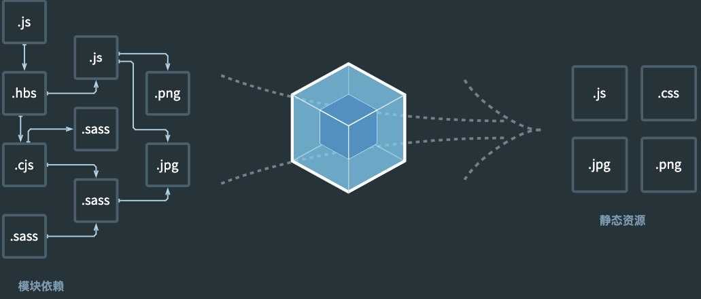

<blockquote style='padding: 10px; font-size: 1em; margin: 1em 0px; color: rgb(0, 0, 0); border-left: 5px solid rgba(0,189,170,1); background: rgb(239, 235, 233);line-height:1;'>
 
号外号外，webpack5这次真的出版了（其实10月份就出正式版了），webpack可以说是前端界最火的打包工具（至少现在是），webpack5的发布标志着webpack进入了一个新的纪元，本文会带大家走进webpack5的世界并尝试搭建一个企业级webpack5开发脚手架。
    
</blockquote>
 